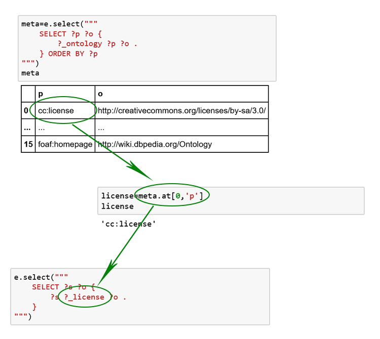

# gastrodon

Toolkit to display,  analyze,  and visualize data and documents based on RDF graphs and the SPARQL query language using Pandas,  Jupyter, and other Python ecosystem tools.

Gastrodon links databases that support the SPARQL protocol ([more than ten!](https://www.w3.org/wiki/LargeTripleStores)) to
[http://pandas.pydata.org/](Pandas),  a popular Python library for analysis of tabular data.  Pandas,  in turn,  is connected to
a vast number of visualization,  statistics, and machine learning tools,  all of which work with [Jupyter](https://jupyter.org/) notebooks.  The result is an ideal environment for telling stories that reveal the value of data,  ontologies, taxonomies, and models.

In addition to remote databases,  Gastrodon can do SPARQL queries over in-memory RDF graphs (from [rdflib](https://github.com/RDFLib/rdflib)).  It has facilities to copy subgraphs from one graph to another,  making it possible to assemble local graphs that contain facts relevant to a particular decision,  work on them intimately,  and then store results in a permanent triple store.

# Seamless Data Translation

# Query Intelligence

# Error messages you can understand
## Error messages before Gastrodon

## Error messages with Gastrodon

The following are reference documentation for tools you will use

* [Pandas](http://pandas.pydata.org/pandas-docs/stable/)
* [Jupyter](http://jupyter.org/index.html)
* [rdflib](https://github.com/RDFLib/rdflib#readme)
* [SPARQL](http://www.w3.org/TR/2013/REC-sparql11-query-20130321/#basicpatterns)

Example notebooks can be found in the [notebooks](notebooks) directory.
