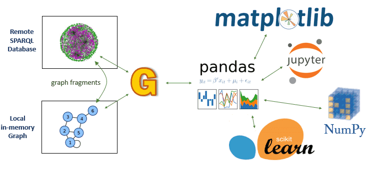

gastrodon
=========

Toolkit to display, analyze, and visualize data and documents based on
RDF graphs and the SPARQL query language using Pandas, Jupyter, and
other Python ecosystem tools.

   Gastrodon Links SPARQL to Pandas

Gastrodon links databases that support the SPARQL protocol (`more than
ten! <https://www.w3.org/wiki/LargeTripleStores>`__) to
`http://pandas.pydata.org/ <Pandas>`__, a popular Python library for
analysis of tabular data. Pandas, in turn, is connected to a vast number
of visualization, statistics, and machine learning tools, all of which
work with `Jupyter <https://jupyter.org/>`__ notebooks. The result is an
ideal environment for telling stories that reveal the value of data,
ontologies, taxonomies, and models.

In addition to remote databases, Gastrodon can do SPARQL queries over
in-memory RDF graphs (from
`rdflib <https://github.com/RDFLib/rdflib>`__). It has facilities to
copy subgraphs from one graph to another, making it possible to assemble
local graphs that contain facts relevant to a particular decision, work
on them intimately, and then store results in a permanent triple store.

Seamless Data Translation
=========================

.. figure:: https://github.com/paulhoule/gastrodon/blob/master/art/logo-hero.png
   :alt: Seamless Data Translation

   Seamless Data Translation

Gastrodon mediates between three data models: (1) RDF, (2) Pandas/NumPy,
and (3) Native Python. Gastrodon lets you use Python variables in your
SPARQL queries simply by adding ``?_`` to the name of your variables.
Unlike many RDF libraries, substitution works with both local and remote
SPARQL endpoints. Gastrodon works with the Python type system to keep
track of details such as "is this variable a URI or a String?" so that
you don't have to.

Query Intelligence
==================

.. figure:: https://github.com/paulhoule/gastrodon/blob/master/art/query-intelligence.png
   :alt: Query Intelligence

   Query Intelligence

Gastrodon always has your back because it understands SPARQL. Gastrodon
automatically keeps track of namespaces and appends ``prefix``
declarations to your queries to keep them short and sweet. Unlike many
RDF libraries, Gastrodon supports variable substitution for queries in
both local and remote stores. Gastrodon identifies ``GROUP BY``
variables and automatically makes them the index of the resulting Pandas
DataFrames so that you can make common visualizations automatically.

Error messages you can understand
=================================

Many software packages ignore error handling, which is a big mistake,
because poor error handling gets in the way of both everyday use and the
learning process. Instead of making excuses, Gastrodon has intelligent
error handling which adds to the convenience of data analysis and
visualization with Gastrodon.

Jupyter native error messages
-----------------------------

.. figure:: https://github.com/paulhoule/gastrodon/blob/master/art/awful-stack-trace.png
   :alt: Awful Stack Trace

   Awful Stack Trace

Improved Error Messages with Gastrodon
--------------------------------------

.. figure:: https://github.com/paulhoule/gastrodon/blob/master/art/good-error-message.png
   :alt: Good Error Message

   Good Error Message

The following are reference documentation for tools you will use

-  `Pandas <http://pandas.pydata.org/pandas-docs/stable/>`__
-  `Jupyter <http://jupyter.org/index.html>`__
-  `rdflib <https://github.com/RDFLib/rdflib#readme>`__
-  `SPARQL <http://www.w3.org/TR/2013/REC-sparql11-query-20130321/#basicpatterns>`__

Example notebooks can be found in the `notebooks <notebooks>`__
directory.
